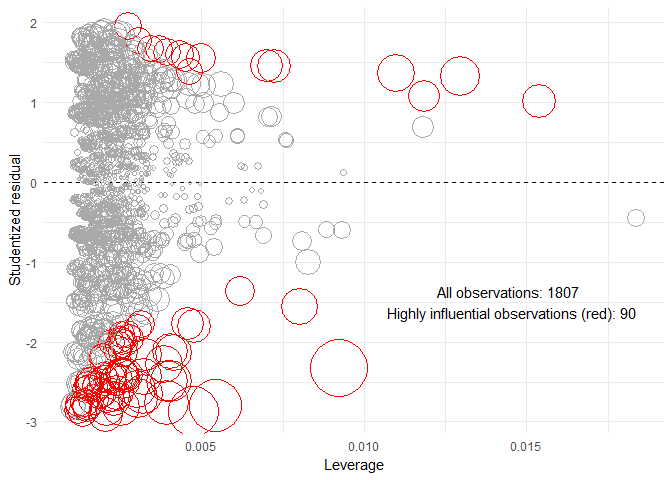
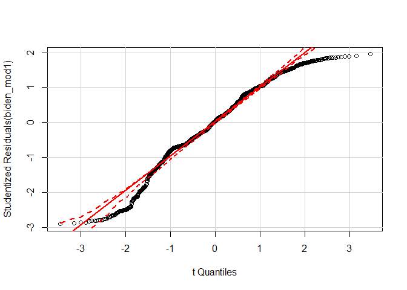
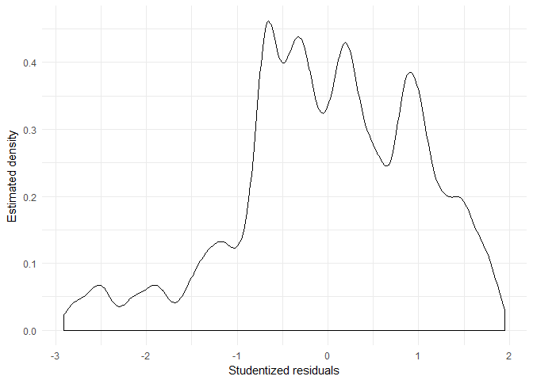
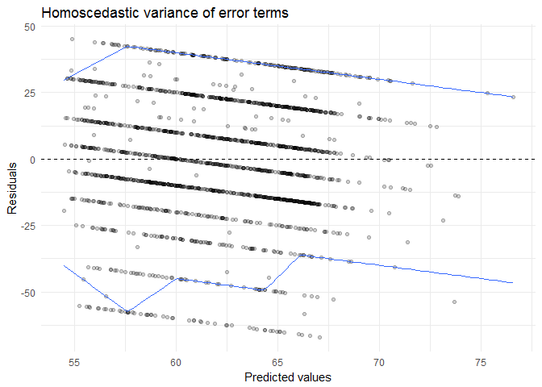
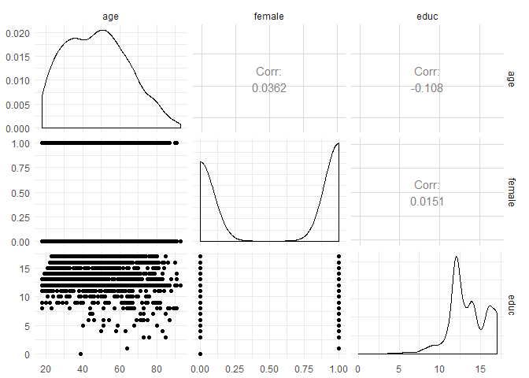
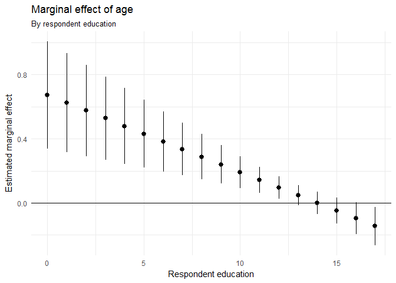
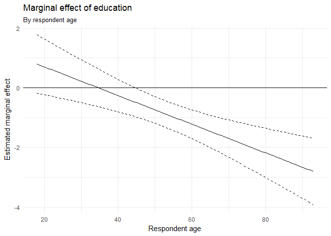

MACS 30200: Problem Set \#3
================
Bobae Kang
May 15, 2017

Regression diagnostics
----------------------

In this section, I first remove observations with missing values using the `na.omit` function (listwise deletion) and fit a simple linear model. The model is:
*Y* = *β*0 + *β*1*X*1 + *β*2*X*2 + *β*3*X*3,
 where *Y* is Biden thermometer score, *X*1 is age, *X*2 is gender (female), and *X*3 is year of education.

The following tables show the estimated coefficients and the goodness of fit of the model. The estimated p-values suggest that, for the coefficients for explanatory variables, only the estimates for gender (female) and year of education (educ) are statistically significant (i.e. rejects the null hypothesis *H*0 : *β* = 0). The `r.squared` value of the model suggests that the given model explains about 27% of the variability for the response variable, *Y*. Not paticuarly impressive. Why is this happening?

| term        |  estimate|  std.error|  statistic|  p.value|
|:------------|---------:|----------:|----------:|--------:|
| (Intercept) |    68.621|      3.596|      19.08|    0.000|
| age         |     0.042|      0.032|       1.29|    0.198|
| female      |     6.196|      1.097|       5.65|    0.000|
| educ        |    -0.889|      0.225|      -3.96|    0.000|

|  r.squared|  adj.r.squared|  sigma|  statistic|  p.value|   df|  logLik|    AIC|    BIC|  deviance|  df.residual|
|----------:|--------------:|------:|----------:|--------:|----:|-------:|------:|------:|---------:|------------:|
|      0.027|          0.026|   23.2|       16.8|        0|    4|   -8240|  16491|  16518|    967076|         1803|

### Test for unusual/influential observations

First, we can test to see if there are any outliers that might impede the model performance. To do so, I compute three different measures unusualness: *leverage* (hat) statistic, *discrepency* (studentized residual) and *Cook's D* (combining leverage and discrepency). Also, I added an extra column, `influential`, to classify highly "influential" observations that can strongly skew the model estimates based on some rules of thumb.

The table below shows the first five observations with additional columns. The following bubble plot shows the 'unusualness' of each observations based on the three measures. The x-axis is leverage (hat) statistics, the y-axis is studientized residual value. The size of each bubble corresponds to the *Cook's D* value. Based on the rules of thumb, observations that are highly influential (total 90) are colored in red.

|  biden|  female|  age|  educ|  dem|  rep|    hat|  student|  cooksd|  influential|
|------:|-------:|----:|-----:|----:|----:|------:|--------:|-------:|------------:|
|     90|       0|   19|    12|    1|    0|  0.003|    1.352|   0.001|            0|
|     70|       1|   51|    14|    1|    0|  0.001|    0.237|   0.000|            0|
|     60|       0|   27|    14|    0|    0|  0.002|    0.116|   0.000|            0|
|     50|       1|   43|    14|    1|    0|  0.001|   -0.612|   0.000|            0|
|     60|       1|   38|    14|    0|    1|  0.001|   -0.171|   0.000|            0|

There are multiple causes such outliers. Perhaps there were some mistakes when collecting and codeing the data. Perhaps they result from a somewhat different data generating process compare to the rest of observations. Because there are multiple causes of outliers, there are also multiple ways to address them.

In this case, I can first make sure that there is no mis-coded data by checking for values that are impossible--values other than 0 and 1 for binary variables, impossible or highly improbable values for continuous variables (e.g. negative age or over 100 thermoeter score). Then I can skim through the observations with high *Cook's D* scores to see if they share certain charateristics, which may point to an additional explanatory variable that needs to be included to build a better model. For example, the following table presents the observations with 10 highest *Cook's D* scores. A quick glance at these observations suggest that being non-Democrat may be able to account for some outliers.

|  biden|  female|  age|  educ|  dem|  rep|    hat|  student|  cooksd|  influential|
|------:|-------:|----:|-----:|----:|----:|------:|--------:|-------:|------------:|
|     20|       1|   58|     4|    0|    1|  0.009|    -2.33|   0.013|            1|
|      0|       1|   90|    16|    0|    1|  0.005|    -2.79|   0.011|            1|
|      0|       1|   91|    14|    0|    1|  0.005|    -2.87|   0.010|            1|
|      0|       0|   72|     9|    0|    0|  0.004|    -2.76|   0.007|            1|
|      0|       0|   78|    16|    0|    0|  0.004|    -2.50|   0.006|            1|
|      0|       0|   77|    16|    0|    1|  0.004|    -2.50|   0.006|            1|
|      0|       0|   77|    16|    0|    1|  0.004|    -2.50|   0.006|            1|
|      0|       0|   77|    16|    0|    1|  0.004|    -2.50|   0.006|            1|
|    100|       0|   85|     3|    1|    0|  0.013|     1.32|   0.006|            1|
|      0|       0|   78|    12|    0|    1|  0.003|    -2.65|   0.006|            1|

Lastly, if possible, collecting more data can be another solution to control for the effect of these unusal observations. For example, if the current dataset is not fully representative of the entire population, a sizable subgroup of the popualtion may appear as outliers in the current dataset.

### Test for non-normality

The linear model expects that the residuals are normally distributed. Non-normality of the residuals can make any inferences based on the given model useless.

There are different ways to test for non-normality of the residuals. The first of the following two plots is called a Quartile-Quartile (Q-Q) plot. In this Q-Q plot, the residuals would begenerally aligned with the red line when the assumption for normality holds. Here we observe that this is not the case. The second plot illustrates the density of studentized residuals for the current model. In an ideal situation, the density distribution will have the bell shape of the normal distribution. In our case, however, the distribution is clearly not bell-shaped--it has multiple local peaks and thicker tails, and is skewed to the left. 

### Test for heteroscedasticity

The linear model also assumes that error terms are homoscedastic, or identically distributed. When error terms are heteroscedastic, or not identically distributed, inferences based on the given model are made unreliable. I test this in two ways: first, graphically, and second, by the studentized Breusch-Pagen test using `lmtest::bptest()`. The graphical representation of residuals show some sort of pattern. We observe that there are multiple lines with the same, nonzero (negative) slope. The *p*-value of `bptest()` also strongly rejects the null hypothesis of homoscedasticity.

    ## 
    ##  studentized Breusch-Pagan test
    ## 
    ## data:  biden_mod1
    ## BP = 20, df = 3, p-value = 5e-05

### Test for multicollinearity

Finally, we test the assumption of the linear model that all explanatory variables are independent of one another. When explanatory variables are correlated with one another, there is a risk of multicollinearity. In the social science context, however, we can tolerate some degree of collinearity. And, in fact, the pairwise comparison chart suggests that there is no serious issue with collinearity for the given data. Using Variance Inflation Factors, with `vif()`, offers a more statistically rigorous way to test for multicollinearity. The results, with small VIF statistics, also suggest little collinearity. 

    ##    age female   educ 
    ##   1.01   1.00   1.01

However, sometimes this is not the case and multicollinearity is present. If that is the case, we can try to use instrument variables or Prinicipal Components to avoid multicollinearity.

Interaction terms
-----------------

In this section, I first remove observations with missing values using the `na.omit()` function (listwise deletion) and fit another linear model with an interaction term. The model is:
*Y* = *β*0 + *β*1*X*1 + *β*2*X*2 + *β*3*X*1*X*2,
 where *Y* is Biden thermometer score, *X*1 is age, *X*2 is year of education, and *X*1*X*2 is the interaction term.

The following tables show the estimated coefficients and the goodness of fit of the model. The low *p*-value for the coefficient for the interaction term, *β*3, suggets that the interaction effect between `age` and `educ` indeed exists. The model explains about 18% of the variability in the reponse variable, still leaving a lot unexplained.

| term        |  estimate|  std.error|  statistic|  p.value|
|:------------|---------:|----------:|----------:|--------:|
| (Intercept) |    38.374|      9.564|       4.01|     0.00|
| age         |     0.672|      0.170|       3.94|     0.00|
| educ        |     1.657|      0.714|       2.32|     0.02|
| age:educ    |    -0.048|      0.013|      -3.72|     0.00|

|  r.squared|  adj.r.squared|  sigma|  statistic|  p.value|   df|  logLik|    AIC|    BIC|  deviance|  df.residual|
|----------:|--------------:|------:|----------:|--------:|----:|-------:|------:|------:|---------:|------------:|
|      0.018|          0.016|   23.3|       10.7|        0|    4|   -8249|  16509|  16536|    976688|         1803|

### Marginal effect of `age`, conditional on `educ`

The marginal effect of age differs for different value for education. The plot below illustrates this marginal effect of age, conditional on education, with confidence interval. The plot shows that the marginal effect of age is positive and statistically significant for the respondents who have had less thant 14 years of education and those with 17 years of education.

The outcome `linearHypothesis()` shows that the marginal effect of age is present and statistically significant (i.e. rejects the null of no marginal effect) for respondents with 10 years of education. This is expected because, in the graphically illustration, the confidence interval (the vertical lines) of the marginal effect at 10 years of education is safely above 0.

    ## Linear hypothesis test
    ## 
    ## Hypothesis:
    ## age  + 10 age:educ = 0
    ## 
    ## Model 1: restricted model
    ## Model 2: biden ~ age * educ
    ## 
    ##   Res.Df    RSS Df Sum of Sq    F  Pr(>F)    
    ## 1   1804 984534                              
    ## 2   1803 976688  1      7846 14.5 0.00015 ***
    ## ---
    ## Signif. codes:  0 '***' 0.001 '**' 0.01 '*' 0.05 '.' 0.1 ' ' 1

### Marginal effect of `educ`, conditional on `age`

The marginal effect of age differs for different value for education. The plot below illustrates this marginal effect of age, conditional on education, with confidence interval. The plot shows that the marginal effect of age is negative and statistically significant for the respondents who are older than 45 years.

The outcome `linearHypothesis()` shows that the marginal effect of education is not statistically significant (i.e. fails to reject the null of no marginal effect) for respondents who are 40 years old. This is expected because, in the graphical illustration, the confidence interval (between the dotted lines) of the marginal effect at 40 years of age include 0. 

    ## Linear hypothesis test
    ## 
    ## Hypothesis:
    ## educ  + 40 age:educ = 0
    ## 
    ## Model 1: restricted model
    ## Model 2: biden ~ age * educ
    ## 
    ##   Res.Df    RSS Df Sum of Sq   F Pr(>F)
    ## 1   1804 977178                        
    ## 2   1803 976688  1       490 0.9   0.34

Missing data
------------

In this section, I fit a simple linear model. The model is:
*Y* = *β*0 + *β*1*X*1 + *β*2*X*2 + *β*3*X*3,
 where *Y* is Biden thermometer score, *X*1 is age, *X*2 is gender (female), and *X*3 is year of education.

Here, I compare two different approaches to missing data. The first appraoch is listwise delection of all observations with missing data, which is done automatically by the `lm()` function when fitting the model. The second approach is Bayesian multiple imputation, using `amelia()` function in `Amelia` package. For the current exercise, we generate 10 datasets with imputed values. Then we combine results from imputed datasets using `Amelia::mi.meld()` function. The following table compares the estimated coefficients and standard errors obtained by these two approaches.

    ## -- Imputation 1 --
    ## 
    ##   1  2  3  4  5  6
    ## 
    ## -- Imputation 2 --
    ## 
    ##   1  2  3  4  5  6
    ## 
    ## -- Imputation 3 --
    ## 
    ##   1  2  3  4  5  6
    ## 
    ## -- Imputation 4 --
    ## 
    ##   1  2  3  4  5
    ## 
    ## -- Imputation 5 --
    ## 
    ##   1  2  3  4  5  6
    ## 
    ## -- Imputation 6 --
    ## 
    ##   1  2  3  4  5
    ## 
    ## -- Imputation 7 --
    ## 
    ##   1  2  3  4  5
    ## 
    ## -- Imputation 8 --
    ## 
    ##   1  2  3  4  5  6
    ## 
    ## -- Imputation 9 --
    ## 
    ##   1  2  3  4  5  6
    ## 
    ## -- Imputation 10 --
    ## 
    ##   1  2  3  4  5

| term        |  estimate|  std.error|  estimate.mi|  std.error.mi|
|:------------|---------:|----------:|------------:|-------------:|
| (Intercept) |    67.558|      3.564|       66.473|         3.757|
| age         |     0.043|      0.032|        0.042|         0.035|
| female      |     6.022|      1.090|        5.526|         1.067|
| educ        |    -0.815|      0.222|       -0.717|         0.230|

In the table, `estimate` and `std.error` present the estimated coefficients and the standard errors of the first model using original dataset after listwise deletion. On the other hand, `estimate.mi` and `std.error.mi` are of the second model using multiple imputation for missing values. We observe that `estimate.mi` values are somewhat smaller in magnitude thant the `estimate` values. Meanwhiler, the greater standard error for the incercept as well as `age` and `educ` variables suggest that the coefficient estimates of the imputed model is not so much more precise than those of the non-imputed model.

I must add that, in the imputing process, I have not applied any transformation to the variables. `log()` tranformation is impossible for `biden` and `educ` due to values of 0 and `female` because it is a categorical variable while `log(age)` does not do much for improving normality for the model. I have tried other simple transformations, such as taking the square root or adding quadratic terms for continous variables, but found no particularly helpful combination of these to fix non-normality.
